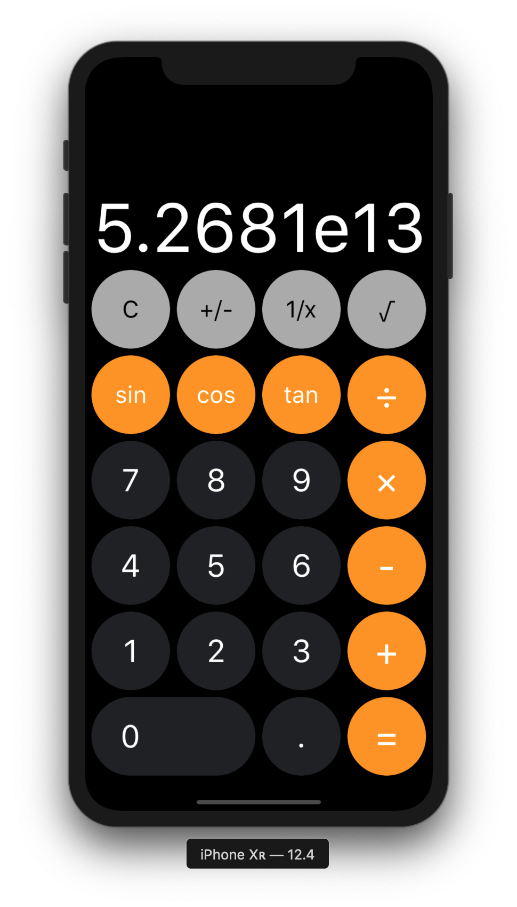

# Calculator

Remake apple calculator

## Getting Started

Clone the project to where you want to have it on your local machine and run it with Xcode

## Quick Look

## Versions

* **Version 1.0:** 

## Author

* [**Nhan Cao**](https://www.linkedin.com/in/nhan-cao/)

### Credits

 Icons inspired by <a href="https://www.flaticon.com/authors/srip" title="srip">srip</a> from <a href="https://www.flaticon.com/"             title="Flaticon">www.flaticon.com</a> 

